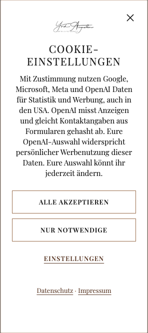
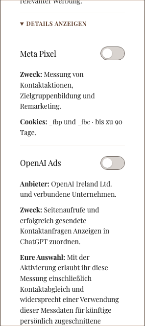

# OpenAI Ads: Einrichtung und Prüfung für Artbild-Fotografie

Stand: 29. September 2026. Die Website-Änderungen sind implementiert und lokal geprüft. Die Produktionsveröffentlichung wird mit der öffentlichen Pixel-ID `2cAZY96fYjnEsMfeaUPEtH` durchgeführt. Ohne konfigurierte Pixel-ID bleibt die Integration ausgeschaltet; auf der Website ist zusätzlich die eigene Einwilligung der Besucher erforderlich.

## Konto und verbindliche Datenschutzvorgabe

- Nach ausdrücklicher Zustimmung zu den Konvertierungsbedingungen wurde die Datenquelle **Artbild-Fotografie Website** erstellt und über den Ads-Connector zurückgelesen.
- Pixel-ID: `2cAZY96fYjnEsMfeaUPEtH` (öffentlich, kein Geheimnis).
- Datenquelle: `cds_6abbeb36ab548199b5a062bc170153d4`.
- Konto: `adacct_6abbddde7fb08199ada58b0cf1ecfef6`.
- Die abgerufene Pixel-Konfiguration meldet `automatic_advanced_matching_enabled: true`.
- Die Pixel-Bearbeitung und die öffentliche Dokumentation zeigten keinen Ausschalter für den automatischen Abgleich. Die Umsetzung informiert daher ausdrücklich über diesen Abgleich und aktiviert ihn erst nach der eigenen Einwilligung.
- Der Betreiber hat klargestellt: Die Einbindung muss zwingend EU-DSGVO-konform erfolgen. Die frühere Auswahlfrage zum Datenumfang ist damit keine noch einzuholende pauschale Freigabe für Kontaktabgleich. Eine Zustimmung des Betreibers ersetzt weder eine Einwilligung der Besucher noch die übrigen Datenschutzanforderungen.
- Weder ein konkreter DSGVO-Verstoß noch eine allgemeine Pflicht zur Abschaltung dieses Abgleichs wurde nachgewiesen. Die technische Prüfung ist abgeschlossen; eine Supportantwort zur Abschaltung ist keine pauschale rechtliche Voraussetzung.
- **Kontaktanfrage erfolgreich** wurde im Konto erstellt. Die Erfolgsmeldung und die gespeicherte Tabellenzeile bestätigen das Basisereignis `lead_created` und die Datenquelle **Artbild-Fotografie Website**. Der Dialog zeigte ein Click-through-Fenster von 30 Tagen und ein View-through-Fenster von einem Tag. Keine Kampagne wurde damit verknüpft; Kampagnen und Budgets wurden bei dieser Tracking-Einrichtung nicht verändert. Der ergänzende Connector-Abruf schlug mit einem internen Fehler fehl; der Speichernachweis beruht auf der Oberfläche.

### Abgeschlossene technische Datenschutzprüfung

Die Consent-Sperre, getrennte Auswahl, minimalen eigenen Ereignisse und der Widerruf einschließlich eines zweiten geöffneten Tabs sind getestet. Der tatsächliche Kontaktabgleich ist im Banner vor der Entscheidung und in den Details beschrieben. Die Besucherauswahl verbindet die Messung ausdrücklich mit einem Widerspruch gegen künftige persönliche Werbenutzung dieser Messdaten; jedes Ereignis enthält dafür `opt_out: true`. Diese Entscheidung wird mit Anbieterwahl, Zeitpunkt und Consent-Version gespeichert. Die Zuordnung zur eingeschränkten Verarbeitung für EWR-Daten folgt dem [Ad Tools DPA](https://openai.com/policies/ad-tools-dpa/), der hierfür die Betreiber-Verantwortlichkeit und OpenAI als Auftragsverarbeiter vorsieht. Der einbezogene [Auftragsverarbeitungsvertrag](https://openai.com/policies/data-processing-addendum/) sowie die [Empfänger-/Länderliste für Werbetools](https://openai.com/policies/ad-tools-subprocessors/) sind verlinkt. Die Hinweise nennen Standardvertragsklauseln zwischen verbundenen Unternehmen, mögliche Drittlandverarbeitung und die vertraglichen Kriterien für Aufbewahrung/Löschung. Eine ausschließlich europäische Speicherung wird nicht zugesagt.

Bei 320 Pixel Breite bleiben „Alle akzeptieren“ und „Nur notwendige“ ohne Scrollen gleichzeitig sichtbar. Der Informationsteil kann auf kleinen Displays unabhängig scrollen. Keine Vorauswahl optionaler Dienste, keine Kopplung an Kontaktaufnahme und keine Übernahme alter Marketing-Einwilligungen. Das dokumentiert die technischen Vorkehrungen und die gelesenen Vertragsgrundlagen, keine unabhängige rechtliche Zertifizierung.

Ein Cookie-Banner allein, Hashwerte oder die Annahme der Anbieterbedingungen belegen keine DSGVO-Konformität. Maßgeblich bleiben insbesondere Datenminimierung, eine tragfähige Rechtsgrundlage, transparente Information, Widerruf und gegebenenfalls die Voraussetzungen für Drittlandübermittlungen. [DSGVO, insbesondere Art. 5–7, 13 und 44 ff.](https://eur-lex.europa.eu/legal-content/DE/TXT/?uri=CELEX:32016R0679).

## Umsetzung

Astro 7, statisch erzeugte Seiten und bestehender Node-/Bunny-Server. Erstmalige OpenAI-Einbindung, Modus **Browser-Pixel**. Zuvor bestanden Google Analytics, Clarity und Meta sowie das gemeinsame Artbild-Ereignissystem.

Der neue Dienst verwendet dessen Consent-API und bestätigte Formularereignisse. Er ist ein eigener Dienst unter Marketing und unabhängig von Meta und Statistik wählbar. Eine OpenAI-Zustimmung lädt keinen Google Tag Manager. Die bestehende Google-Variable `consent_marketing` bleibt absichtlich an Meta gebunden.

Vor der eigenen Einwilligung gibt es keinen Abruf des OpenAI-Skripts, keine OpenAI-Warteschlange und keine OpenAI-Messung. Die Consent-Version wird auf `2026-09-29.1` erhöht; alte Entscheidungen und alte pauschale Marketing-Freigaben aktivieren den neuen Anbieter nicht. Die Standardwerte in Docker, Workflow, Beispielkonfiguration und Browserprüfungen sind angepasst.

Bei Widerruf wird die OpenAI-Zustimmung unmittelbar entzogen, eine noch nicht abgearbeitete Warteschlange gelöscht, die Anzeigen-/Browserkennung entfernt und die Seite neu geladen. Eine notwendige lokale Broadcast-Nachricht teilt nur die Änderung der Auswahl anderen Tabs mit; diese lesen das Consent-Cookie erneut. Zusätzlich wird die gespeicherte Entscheidung vor jeder OpenAI-Messung sowie beim Wiederanzeigen einer Seite geprüft. Eine erneute Freigabe sendet zuvor blockierte Kontaktanfragen nicht nach. Trackingfehler dürfen den Versand des Kontaktformulars nicht verhindern.

### Ereignisse

| Ereignis | Auslöser und Umfang |
| --- | --- |
| `page_viewed` | Einmal pro Dokument nach eigener Einwilligung; keine doppelten Aufrufe beim Speichern derselben Auswahl. |
| `lead_created` | Nach erfolgreicher Antwort von `/api/contact`, über das bestehende `artbild:form_success` für `kontakt_anfrage_form`. Einmal pro Dokument, um doppelte Erfolgsbenachrichtigungen nicht mehrfach zu zählen. |

Kein Geldwert wird erfunden. Klicks, Validierungsfehler, Serverfehler, bloße Terminprüfungen, Telefon-/WhatsApp-/Mail-Links werden nicht als bestätigte Anfrage gezählt. Wiederholte separate Einsendungen ohne Seitenwechsel werden bewusst nicht mehrfach gezählt.

Bereits vorhandene OpenAI-Ereignisse: keine. Kein zusätzliches `contents_viewed`, weil die allgemeine Seitenansicht bereits erfasst wird und keine eigenständige, verifizierte Produktansicht benötigt wird. `items_added`, `checkout_started`, `order_created`: kein Warenkorb oder Onlinekauf. `registration_completed`: keine öffentliche Registrierung. `appointment_scheduled`: die Terminabfrage bestätigt keine Buchung. `subscription_created`, `trial_started`: kein entsprechendes Angebot. App-Ereignisse: kein mobiles App-Produkt. Keine benutzerdefinierten Ersatzereignisse.

Ausgenommen bleiben Seiten ohne bestehende Tracking-Komponenten, insbesondere die Agentenreferenz, Web Stories, Verwaltungs- und Fehlerseiten. Keine zusätzliche serverseitige Integration, keine neue Infrastruktur.

### Daten und automatischer Abgleich

Die selbst erzeugten Ereignisse enthalten nur den Ereignisnamen, den dokumentierten Datentyp und `opt_out: true`. Kein manuelles `user`-Objekt: Es gibt keinen freigegebenen bestehenden Pfad für die Weitergabe von Kontaktangaben. Die vorhandene Trennung von Formularinhalten und Ereignisdaten wird beibehalten. Ein zweites `init({user})` wird deshalb bewusst ausgelassen.

**Das verhindert den automatischen Abgleich des Anbieters nicht.** Im isolierten Test wurde das unveränderte offizielle Skript geladen, die aktive Konfiguration nachgebildet und ausschließlich eine künstliche Kontaktanfrage verwendet. Der abgefangene Versand enthielt den SHA-256-Hash der künstlichen E-Mail-Adresse, obwohl unsere `measure`-Aufrufe keinen Kontaktwert enthalten. Keine echten Kunden- oder Kontaktdaten wurden dafür verwendet; die OpenAI-Ereignisanfragen wurden lokal abgefangen.

Banner und Datenschutzerklärung informieren deshalb ausdrücklich über den möglichen Abgleich gehashter Kontaktangaben. Hashwerte werden nicht als anonym bezeichnet. Der verwendete Opt-out betrifft zukünftige nutzerbezogene Personalisierung; er ist kein Ausschalter für Abgleich oder Messung. [Offizielle Pixel-Dokumentation](https://developers.openai.com/ads/measurement-pixel).

Weitere durch das SDK verwaltete Daten: Anzeigenzuordnung `oppref`, Browserkennung, Zeitstempel und Seitenadresse. Die Dokumentation nennt beim `source_url` den Ursprung; das geprüfte SDK 0.1.41 enthielt **Ursprung plus Pfad**. Der Test mit künstlichen Werten in Query und Fragment bestätigte deren Entfernung. Der Datenschutzhinweis beschreibt das beobachtete Verhalten, ohne eine undokumentierte SDK-Option zu verwenden.

Attribution, Cookie-Laufzeiten und Ereignis-IDs werden vom SDK verwaltet. Der Browser-/Server-Abgleich ist nicht relevant, weil kein CAPI eingerichtet ist. Die lokalen Sperren verhindern mehrfache Initialisierung und doppelte Erfolgsbenachrichtigungen pro Dokument. Es werden keine CAPI-Schlüssel erstellt, angefordert oder gespeichert; CAPI-Secret, serverseitiger `oppref`, serverseitiger `source_url` und dessen Vertrauensgrenze sind nicht anwendbar.

Die Datenschutzerklärung nennt Einwilligung, Widerruf, Cookie-Laufzeiten, möglichen Drittlandtransfer und Anbieterbedingungen. Browser-Cookie-Laufzeiten werden von der Aufbewahrung bei OpenAI getrennt. Es wird keine feste OpenAI-Aufbewahrungsfrist erfunden. Vertragsgrundlagen: [Conversion Terms](https://openai.com/policies/conversion-terms/), [Ad Tools DPA](https://openai.com/policies/ad-tools-dpa/). Für den Zugriff auf das Endgerät: [§ 25 TDDDG](https://www.gesetze-im-internet.de/tdddg/__25.html).

Der offizielle [Image Tag](https://developers.openai.com/ads/image-tag) wurde als Alternative geprüft. Er ist für Seitenladeereignisse beschrieben und übernimmt die Anzeigenzuordnung nicht selbst. Für das bestehende interaktive Kontaktformular wurde kein Ersatz außerhalb der dokumentierten SDK-Schnittstelle eingebaut.

## Geänderte Dateien

- Einwilligung und Ereignisweitergabe: `src/components/TrackingHead.astro`, `ConsentBanner.astro`, `TrackingDataLayer.astro`.
- Neuer zentraler Adapter: `src/lib/openaiAds.mjs`.
- Datenschutzhinweise: `src/lib/privacyContent.ts` (beide Datenschutz-URLs).
- Öffentliche Build-Konfiguration: `src/config/tracking.ts`, `trackingDefaults.mjs`, `.env.example`, `scripts/validate-tracking-config.mjs`, `Dockerfile`, `.github/workflows/bunny-dev-image.yml`.
- Sicherheitsrichtlinie: `server/bunny-server.mjs`; ergänzt nur die dokumentierten OpenAI-Domains. Keine zusätzliche Inline-Skript-Freigabe.
- Prüfungen: `tests/openai-ads-consent.spec.ts`, `tracking-consent.spec.ts`, `tracking-config.test.mjs`, `datenschutz-content.spec.ts`, `bunny-runtime.test.mjs`, `playwright.config.ts`.
- Betriebsdokumentation: `docs/tracking-consent.md` und dieser Bericht.

## Mobile Vorschau

Geprüft bei 320 Pixel Breite. Der Dialog lässt sich vertikal scrollen; es gibt keinen horizontalen Überlauf.





## Prüfergebnisse

- **21 bestehende Consent-/Formular-Browsertests bestanden.** Alte feste Termin-Testdaten waren inzwischen vergangen; die Testuhr ist dafür auf den 1. September 2026 fixiert.
- **10 OpenAI-Browsertests bestanden**, einschließlich des offiziellen SDKs mit abgefangenem Transport. Geprüft: vor Zustimmung blockiert, eigenständige Auswahl, keine Wiederholung alter Ereignisse, bestätigter Erfolg, Serverfehler, doppelte Erfolgsbenachrichtigung, Skriptfehler, Widerruf beim Laden und im zweiten Tab, alte Consent-Version, mobile Ansicht und gleichzeitig sichtbare Zustimmungs-/Ablehnungsschaltflächen.
- Der Test mit dem echten SDK bestätigte zusätzlich: Query/Fragment bleiben aus `source_url` heraus; `opt_out` kommt an; der automatische E-Mail-Abgleich ist aktiv; die Anzeigenkennung bleibt beim Seitenwechsel erhalten und wird beim Widerruf entfernt.
- **5 Datenschutz-/Kontaktseiten-Browsertests bestanden.**
- **63 Tests des vollständigen Bunny-Laufzeitpakets und 8 Konfigurationstests bestanden**, einschließlich CSP-Freigaben und ungültiger Pixel-Konfiguration.
- Vollständiger Website-Build mit der echten öffentlichen Pixel-ID erfolgreich, einschließlich **4 Inhaltsprüfungen**. Das ist ein lokaler Prüfbuild, keine Veröffentlichung.
- Statischer Plugin-Check der geänderten Implementierungsdateien: bestanden. Der vollständige Setup-Scan wurde wegen langer Laufzeit abgebrochen; der fokussierte Scan bestand. Der vollständige CAPI-Geheimnis-Scan des Repositories schloss ohne Befund ab. Nicht benötigte CAPI-/Deduplizierungsmarker sind bei der reinen Browser-Integration keine Pflicht.
- Kein echter Kontaktversand und kein Test-Conversion-Versand an OpenAI: Kontakt-Backend und Werbe-Endpunkte wurden in den Browserprüfungen abgefangen.
- Öffentliche Kontaktseite abschließend gelesen: HTTP 200, bisherige Consent-Version `2026-09-02.1`, kein OpenAI-Schalter und keine konfigurierte OpenAI-Integration. Die Veröffentlichung steht aus.
- Noch kein Nachweis des Eingangs im echten Ads-Ereignisstream oder einer zugeordneten Anzeigenkonversion. Ein bestandener lokaler Test ist kein solcher Nachweis.

Reproduzierbarer lokaler Start (nur künstliche Testkennungen):

```sh
PUBLIC_TRACKING_ENV=test PUBLIC_TRACKING_ALLOWED_HOSTS=127.0.0.1,localhost PUBLIC_GTM_CONTAINER_ID=GTM-TEST1 PUBLIC_GA4_MEASUREMENT_ID=G-TEST123 PUBLIC_OPENAI_ADS_PIXEL_ID=TEST_OPENAI_PIXEL npm run dev -- --port 4326
ASTRO_URL=http://127.0.0.1:4326 PUBLIC_GTM_CONTAINER_ID=GTM-TEST1 PUBLIC_GA4_MEASUREMENT_ID=G-TEST123 npx playwright test tests/tracking-consent.spec.ts tests/openai-ads-consent.spec.ts tests/datenschutz-content.spec.ts --workers=1
```

Der zusätzliche Test mit dem Original-SDK benötigt `OPENAI_ADS_SDK_PATH` mit dem Pfad einer separat von der offiziellen CDN-Adresse bezogenen Kopie. Ohne diesen Wert wird nur dieser eine Test ausdrücklich übersprungen. Das SDK wird nicht im Repository mitgeführt.

## Noch bis zum Livebetrieb

1. Technische Prüfung und dazu passende Banner-/Datenschutztexte sind abgeschlossen. Der automatische Kontaktabgleich bleibt Bestandteil der ausdrücklich beschriebenen optionalen Einwilligung. Eine Supportanfrage zu seiner Abschaltung ist kein Umsetzungshindernis und wurde nicht versendet.
2. Abschließenden Website-Build und die Veröffentlichung der konkreten Änderung nachvollziehen. Der dokumentierte Image Tag wird nicht als unbestätigter Ersatz für das interaktive Kontaktformular eingesetzt.
3. Die Conversion-Ereignisdefinition für `lead_created` ist fertig. Keine Kampagnenoptimierung oder Budgetänderung ist Teil dieser Änderung.
4. Die öffentliche Build-Variable `PUBLIC_OPENAI_ADS_PIXEL_ID=2cAZY96fYjnEsMfeaUPEtH` setzen, das unveränderliche Bunny-Produktionsimage bauen und nach dem vorhandenen Releaseverfahren veröffentlichen.
5. Öffentliche Routen, Cookie-Banner und Netzwerkanfragen auf Desktop/Mobilgeräten erneut prüfen; einen ausdrücklich vereinbarten Test am echten Ereignisstream nachvollziehen. Keine Kundenanfrage zu Testzwecken versenden.

Vor der Veröffentlichung muss der Betreiber prüfen, dass Umsetzung und Datenumfang seine Datenschutz-, Sicherheits-, Einwilligungs- und Datenverarbeitungsanforderungen erfüllen. Dieser technische Prüfbericht ist keine rechtliche Freigabe.
